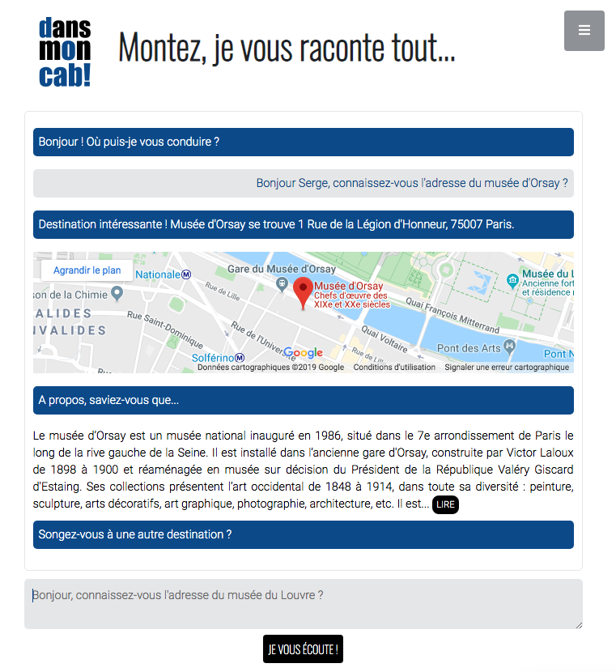

# dansMonCab!

### Table of contents
* [Description](#description)
* [Features](#features)
* [Technical requirements](#technical-requirements)
* [Status](#status)
* [Contributing](#contributing)
* [Authors](#authors)
* [License](#license)

## Description

dansMonCab! is a tiny chatbot that provides the user with information about a point of interest (e.g. a company, a public place, a monument...). 

Intended for French users, the language communication of dansMonCab! is French. 

Feel free to <a target="_blank" href="https://dansmoncab.herokuapp.com/">play with it</a>! And be kind with Serge, our taxi driver, who sometimes will need you to spell again... 

## Features



The user asks a simple question such as: "Bonjour Serge, connaissez-vous l'adresse du musée du Louvre ?". 
Then the chatbot returns the address of the targeted entity together with a clickable map and a short presentation extracted from <a target="_blank" href="https://www.mediawiki.org/wiki/API:Main_page">MediaWiki API</a>.
  
User input parsing benefits from advanced NLP (Natural Language Processing) through the use of <a target="_blank" href="https://spacy.io/">**spaCy**</a> and its NER (Named Entity Recognition) features. 

The app also includes a scraper which leverages Google results.

## Technical requirements

The application is programmed in **Python** 3.7.3 and relies on the framework <a target="_blank" href="http://flask.palletsprojects.com/en/1.1.x/">**Flask**</a> 1.1.1.

You can use the package manager [pip](https://pip.pypa.io/en/stable/) to install all the required libraries.

```bash
pip3 install -r requirements.txt
```

## Status

This project is in progress.

## Contributing
Pull requests are welcome. For major changes, please open an issue first to discuss what you would like to change.

Please make sure to update tests as appropriate.

## Authors

- Initial work: Stephanie BLANCHET, Data Science and Application Pythonist.
- Contact: stephanie.blanchet.it@gmail.com

## License
This project is licensed under the MIT License - see [MIT](https://choosealicense.com/licenses/mit/) for details.
